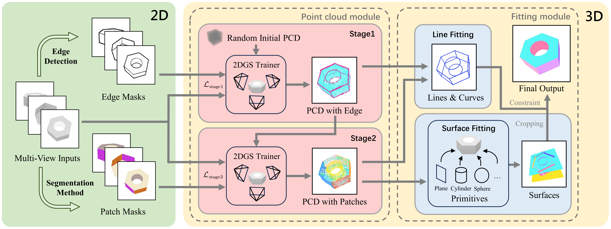

# BrepGaussian: CAD reconstruction from Multi-View Images with Gaussian Splatting
 
> 🎉 **Accepted to CVPR 2026** 🎉
>
> 📢 We are pleased to announce that **BrepGaussian** has been **accepted** ✅ to the **IEEE/CVF Conference on Computer Vision and Pattern Recognition (CVPR) 2026**. 📄 The paper is available on [arXiv](https://arxiv.org/abs/2602.21105). 💻 This repository provides the official implementation released with the paper.

<p align="center">
  
</p>

---

This repository contains the code for our paper. The pipeline is: two-stage training (`train_stage1` → `train_stage2`) on a customized **3D Gaussian Splatting** variant, producing a semantically labeled point cloud, then **B-Rep** fitting of analytic planes/cylinders, wireframes, and surface meshes.

The environment matches official [3D Gaussian Splatting](https://github.com/graphdeco-inria/gaussian-splatting).

---

## 1. Build the custom rasterizer (required)

In addition to components such as `simple-knn` from vanilla 3DGS, this repo ships a CUDA extension with segmentation / surfel-related features under **`GS/submodules/diff-surfel-segment-rasterization`**. You **must rebuild and install it** in your environment:

```bash
cd GS/submodules/diff-surfel-segment-rasterization
pip install -e .
```

If you change PyTorch or CUDA, reinstall from this directory.

---

## 2. Data and example scene `00000699`

The end-to-end example below uses the following paths (relative to the repo root):

| Path | Description |
|------|-------------|
| `00000699/` | Scene data (`transforms_train.json` + multi-view supervision images; same CLI conventions as original 3DGS) |

Each scene directory is expected to contain the subfolders below. In `transforms_train.json`, each frame's `file_path` points to `./train_img/<id>_colors`; companion images are resolved by replacing `train_img` with the corresponding folder name (see `GS/scene/dataset_readers.py`).

| Folder | Used in training | Role |
|------|------------------|------|
| `train_img/` | Stage 1 & 2 | RGB multi-view renders (photometric supervision) |
| `edge_img/` | Stage 1 & 2 | Edge maps (edge supervision) |
| `mask_img/` | Stage 2 | Per-face instance masks (segmentation / feature supervision) |
| `corner_img/` | — | Placeholder only (see below) |
| `line_mask_img/` | — | Placeholder only (see below) |

### 2.1 Data preprocessing

#### `train_img` and `edge_img`

Generate these by following the **rendering logic and data processing** in [NEF_code](https://github.com/yunfan1202/NEF_code). The released training code expects the same multi-view layout and naming convention (`<view_id>_colors.png` under each subfolder).

#### `mask_img`

Per-face masks are obtained with a **fine-tuned SAM** model:

1. Download the checkpoint from [BrepGuassianMask on Hugging Face](https://huggingface.co/yjx2851/BrepGuassianMask).
2. The model is fine-tuned on top of [Segment Anything (SAM)](https://github.com/facebookresearch/segment-anything); install SAM and load the provided weights following the SAM inference API.
3. Run inference on each image in `train_img/` to produce the corresponding masks in `mask_img/` (same view IDs and resolution). These masks are used in **Stage 2** for instance-level feature learning.

#### `corner_img` and `line_mask_img` (placeholders)

We also ship `corner_img/` and `line_mask_img/` as auxiliary data that may be useful for label acquisition in future work. **They are not used** in the current training pipeline (`train_stage1.py` / `train_stage2.py`); the folders are included for completeness only.

The following commands assume you work from the **repository root**; training scripts live under **`GS/`**. As in the original Gaussian Splatting code, **`-s`** is the scene path and **`-m`** is the **base** output path (the scripts append `_stage1` / `_stage2` automatically).

---

## 3. Two-stage Gaussian training (`train_stage1` → `train_stage2`)

Run from the **`GS/`** directory:

```bash
cd GS

# Stage 1: geometry, appearance, and edge-related supervision (output: <base>_stage1)
python train_stage1.py \
  -s ../00000699 \
  -m ../00000699_GS \

# Stage 2: segmentation / feature stage (loads from Stage 1 chkpnt30000 by default, 15k iterations; output: <base>_stage2)
# After training, the script runs point export and clustering to produce merged.pcd (see the end of train_stage2.py)
python train_stage2.py \
  -s ../00000699 \
  -m ../00000699_GS \
```

Notes:

- CLI arguments follow **vanilla 3DGS**: `ModelParams` / `OptimizationParams` / `PipelineParams` (e.g. `-s`, `-m`, `--iterations`, etc.).
- `-m ../00000699_GS` is the output **base**; actual folders are **`00000699_GS_stage1`** and **`00000699_GS_stage2`**.
- Stage 2 defaults to **`--start_checkpoint 30000`**; it must match the checkpoint iteration saved in Stage 1. If Stage 1 stops at another iteration, change this and ensure `00000699_GS_stage1/chkpnt<iter>.pth` exists.
- After Stage 2, the labeled point cloud for B-Rep is typically **`00000699_GS_stage2/merged.pcd`** (produced by the Stage 2 post-processing block).

---

## 4. B-Rep: from point cloud to analytic patches and wireframes

For module overview and algorithms, see **`BRep/README.md`**. Below is the **usage** section (aligned with `BRep/README.md` in this repo), wired to `merged.pcd` from above.

### 4.1 Dependencies

- **Python**: 3.11 or later  
- **Packages**:

```bash
pip install numpy scipy scikit-learn open3d trimesh shapely
```

### 4.2 Run surface fitting pipeline

Run from the **`BRep/`** directory:

```bash
cd BRep
python surface_fitting_pipeline.py --pcd ../00000699_stage2/merged.pcd --output ../00000699_Brep

or

python surface_fitting_pipeline.py   --pcd ../data/00000699_stage2/merged.pcd   --output ../00000699_Brep   --no_visualize
```


---

## Citation

If you use this code, please cite our paper (BibTeX to be added) and the foundational work on **3D Gaussian Splatting** and **2D Gaussian Splatting** (see `LICENSE` and READMEs in submodules).
